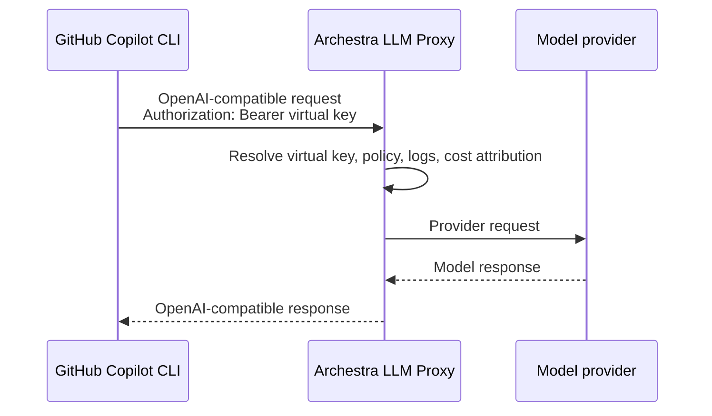

# GitHub Copilot CLI with Archestra LLM Proxy

This example shows how to run GitHub Copilot CLI through Archestra's
OpenAI-compatible LLM Proxy with a virtual key.

The flow is:



## Prerequisites

- Archestra running locally:
  - frontend: `http://localhost:3000`
  - backend: `http://localhost:9000`
- At least one configured LLM provider API key in Archestra.
- Node.js 20+.
- GitHub Copilot CLI:

```sh
npm install -g @github/copilot
```

## Create a Copilot env file

The setup script logs into local Archestra, creates a virtual key, and writes
Copilot's custom-provider environment variables to `.env.copilot`.

```sh
npm run setup
```

Defaults:

| Variable | Default |
| --- | --- |
| `ARCHESTRA_UI_BASE_URL` | `http://localhost:3000` |
| `ARCHESTRA_API_BASE_URL` | `http://localhost:9000` |
| `ARCHESTRA_EMAIL` | `admin@example.com` |
| `ARCHESTRA_PASSWORD` | `password` |
| `ARCHESTRA_PROVIDER` | first available provider key |
| `ARCHESTRA_MODEL` | provider key's best model, or first matching model |

Override them if needed:

```sh
ARCHESTRA_PROVIDER=azure ARCHESTRA_MODEL=gpt-4.1 npm run setup
```

## Run Copilot through Archestra

```sh
source .env.copilot

copilot -p "Reply with exactly: archestra-copilot-cli-ok"
```

Expected output includes:

```text
archestra-copilot-cli-ok
```

Depending on your GitHub Copilot organization policy, Copilot may print a
warning about MCP servers before the model response. That warning does not
affect the LLM Proxy path.

For an interactive coding session:

```sh
source .env.copilot
copilot
```

## Notes

- GitHub authentication is not required when Copilot CLI runs with a custom
  provider.
- `COPILOT_PROVIDER_TYPE` is set to `openai` because Copilot speaks the
  OpenAI-compatible protocol. `COPILOT_PROVIDER_BASE_URL` still uses the
  selected Archestra provider path, for example `/v1/azure/<llm-proxy-id>` for
  an Azure-mapped virtual key.
- The virtual key value is written once to `.env.copilot`. Treat it like a
  secret.
- Delete or rotate the virtual key in Archestra after the demo if you no longer
  need it.
