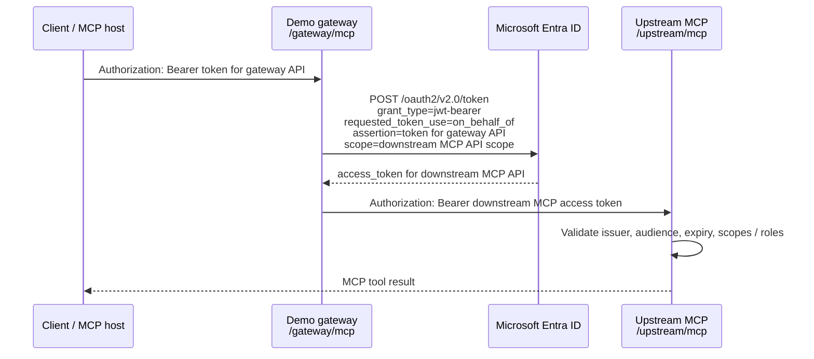

# MCP Gateway Entra On-Behalf-Of Example

This example demonstrates the Entra ID On-Behalf-Of (OBO) flow for an MCP gateway.

The gateway receives a user access token, exchanges it at Entra for a downstream
MCP API access token, and calls the upstream MCP server with:

```http
Authorization: Bearer <downstream-mcp-access-token>
```

It is intentionally small: one Node process exposes both a demo gateway endpoint
and a demo upstream MCP endpoint so you can see the exact token handoff.

## Architecture



## Run Locally

The default mode is self-contained. It starts a local demo issuer that mimics the
parts of Entra needed for OBO:

- a JWKS endpoint
- a gateway access-token mint endpoint
- an OBO token endpoint

This keeps the example runnable without creating cloud app registrations.

```sh
chmod +x test.sh
./test.sh
```

The test proves:

1. the gateway receives a bearer token issued for the gateway audience
2. the gateway performs an OBO-style token exchange
3. the upstream MCP endpoint receives a different bearer token issued for the
   downstream MCP audience
4. the upstream MCP endpoint rejects the original gateway token

You can also run it manually:

```sh
npm install
npm run start

ASSERTION_TOKEN=$(curl -s http://127.0.0.1:3456/demo-entra/mint-gateway-token \
  -H "Content-Type: application/json" \
  -d '{"username":"demo@example.com"}' | jq -r .access_token)

curl -s http://127.0.0.1:3456/gateway/mcp \
  -H "Authorization: Bearer $ASSERTION_TOKEN" \
  -H "Content-Type: application/json" \
  -H "Accept: application/json, text/event-stream" \
  -d '{"jsonrpc":"2.0","id":1,"method":"tools/call","params":{"name":"debug-auth-token","arguments":{}}}' \
  | jq .
```

## Real Entra Setup

You need two app registrations.

### 1. Gateway/API app

This represents the MCP gateway, or Archestra when configured as the gateway.

1. Create an app registration.
2. Expose an API scope, for example `access_as_user`.
3. Note the Application ID URI, for example:

   ```text
   api://11111111-1111-1111-1111-111111111111
   ```

4. Create a client secret for the app. This confidential client performs the
   OBO exchange.

### 2. Downstream MCP API app

This represents the MCP server's protected API.

1. Create another app registration.
2. Expose an API scope, for example `MCP.Access`.
3. Note the scope:

   ```text
   api://22222222-2222-2222-2222-222222222222/MCP.Access
   ```

4. In the gateway/API app, add API permission for this downstream MCP scope and
   grant admin consent if your tenant requires it.

## Configure

```sh
cp .env.example .env
```

Fill in:

| Variable | Meaning |
| --- | --- |
| `ENTRA_TENANT_ID` | Entra tenant ID |
| `GATEWAY_AUDIENCE` | Audience expected on the incoming gateway token, usually the gateway app's Application ID URI |
| `GATEWAY_CLIENT_ID` | Gateway app client ID |
| `GATEWAY_CLIENT_SECRET` | Gateway app client secret |
| `MCP_SCOPE` | Downstream MCP API scope requested during OBO |
| `MCP_AUDIENCE` | Audience expected by the upstream MCP server |
| `LOCAL_DEMO_MODE=false` | Use real Entra endpoints instead of the local demo issuer |

Start the server:

```sh
npm install
npm run start
```

Then obtain a user access token for the gateway API using your normal client app
or Azure CLI, and call the gateway:

```sh
curl -s http://localhost:3456/gateway/mcp \
  -H "Authorization: Bearer $ASSERTION_TOKEN" \
  -H "Content-Type: application/json" \
  -H "Accept: application/json, text/event-stream" \
  -d '{"jsonrpc":"2.0","id":1,"method":"tools/call","params":{"name":"debug-auth-token","arguments":{}}}'
```

## Using the Same Pattern in Archestra

In Archestra, the platform plays the gateway role:

1. Configure an Entra identity provider.
2. Configure enterprise-managed credentials with:
   - exchange strategy: Entra OBO
   - token endpoint: `https://login.microsoftonline.com/<tenant-id>/oauth2/v2.0/token`
   - client ID / client secret: the gateway confidential client
   - subject token type: access token
   - scope/resource identifier: the downstream MCP API scope
3. Configure the MCP server to receive a bearer token.
4. Assign the tool credential mode as enterprise-managed.

The upstream MCP server should validate the bearer token exactly like
`/upstream/mcp` does in this example: verify the Entra issuer, audience, expiry,
and any scopes or app roles your tool requires.

## Key Files

| File | Description |
| --- | --- |
| `src/server.ts` | Demo gateway, Entra OBO exchange, and upstream MCP server |
| `.env.example` | Required Entra values |
| `src/server.test.ts` | Local end-to-end tests for the OBO handoff |
| `test.sh` | Runs install, typecheck, and local end-to-end tests |
