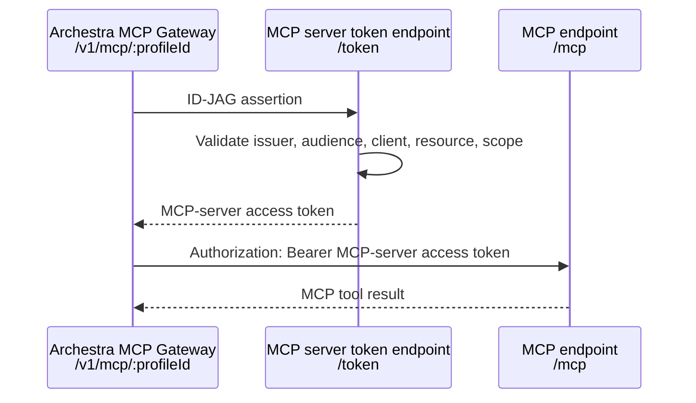

# MCP Server ID-JAG Example

This example demonstrates an MCP server that supports the ID-JAG pattern with
Archestra's MCP Gateway.

The server exposes:

- an OAuth protected resource metadata endpoint
- an authorization-server metadata endpoint
- a token endpoint that accepts an ID-JAG assertion
- an MCP endpoint that accepts only the minted MCP access token

The important distinction is that the MCP server does **not** accept the original
ID-JAG as its bearer token. The ID-JAG is an assertion used at `/token`; the MCP
endpoint receives a server-specific access token minted from that assertion.

## Architecture



## Run Locally

```sh
chmod +x test.sh
./test.sh
```

The tests prove:

1. a demo identity provider mints an ID-JAG assertion
2. `/token` exchanges that assertion for an MCP-server access token
3. `/mcp` accepts the minted MCP access token
4. `/mcp` rejects the original ID-JAG assertion as a bearer token

When configured in Archestra, MCP clients call Archestra's MCP Gateway with the
ID-JAG assertion:

```http
POST /v1/mcp/:profileId
Authorization: Bearer <id-jag-assertion>
```

Archestra exchanges the assertion at the MCP server's protected-resource token
endpoint and then calls `/mcp` with `Authorization: Bearer
<mcp-server-access-token>`.

## Manual Flow

```sh
npm install
npm run build
npm start
```

Mint a demo ID-JAG:

```sh
ASSERTION=$(curl -s http://127.0.0.1:3458/demo-idp/mint \
  -H "Content-Type: application/json" \
  -d '{"sub":"admin","email":"admin@example.com","name":"Admin User"}' \
  | jq -r .assertion)
```

Exchange it for an MCP access token:

```sh
ACCESS_TOKEN=$(curl -s http://127.0.0.1:3458/token \
  -u id-jag-resource-client:id-jag-resource-secret \
  -H "Content-Type: application/x-www-form-urlencoded" \
  -d "grant_type=urn:ietf:params:oauth:grant-type:jwt-bearer" \
  --data-urlencode "assertion=$ASSERTION" \
  | jq -r .access_token)
```

Call the MCP server:

```sh
curl -s http://127.0.0.1:3458/mcp \
  -H "Authorization: Bearer $ACCESS_TOKEN" \
  -H "Content-Type: application/json" \
  -H "Accept: application/json, text/event-stream" \
  -d '{"jsonrpc":"2.0","id":1,"method":"tools/call","params":{"name":"whoami","arguments":{}}}' \
  | jq .
```

## Production Notes

In production, replace the demo identity provider with your enterprise identity
provider and enforce the same checks this example performs:

- assertion issuer and signature
- token endpoint client authentication
- expected audience
- requested resource
- allowed scope
- expiry and replay controls

## Key Files

| File | Description |
| --- | --- |
| `src/server.ts` | ID-JAG issuer demo, token endpoint, and protected MCP endpoint |
| `src/server.test.ts` | Local end-to-end tests |
| `test.sh` | Install, build, and test wrapper |
