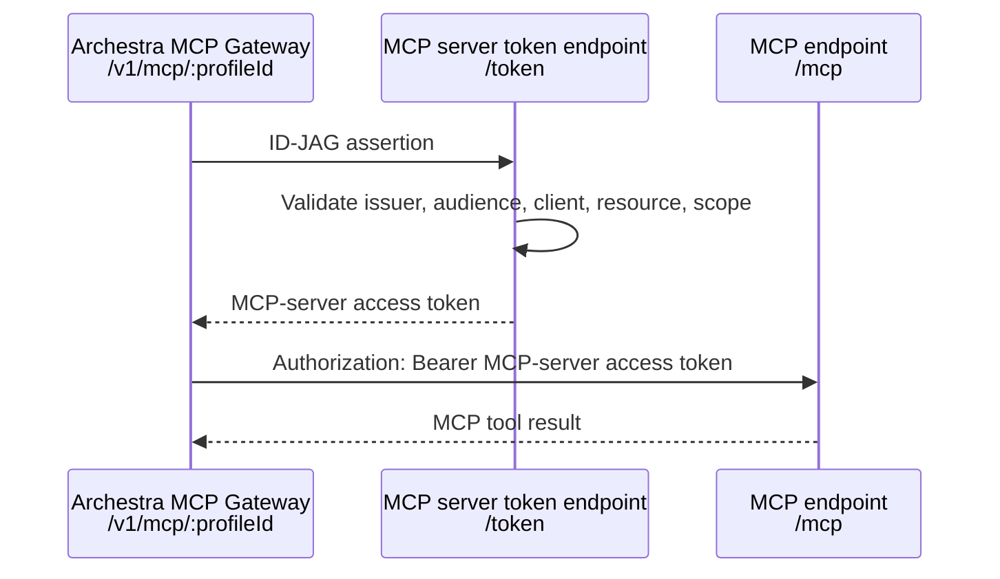

# MCP Server ID-JAG Example

This example demonstrates an MCP server that supports the ID-JAG pattern with
Archestra's MCP Gateway.

The server exposes:

- an OAuth protected resource metadata endpoint
- an authorization-server metadata endpoint
- a token endpoint that accepts an ID-JAG assertion
- an MCP endpoint that accepts only the minted MCP access token

The important distinction is that the MCP server does **not** accept the original
ID-JAG as its bearer token. The ID-JAG is an assertion used at `/token`; the MCP
endpoint receives a server-specific access token minted from that assertion.

## IdP Support Matrix

As of this writing (June 2026), ID-JAG-capable issuer support is emerging:

| IdP / issuer | ID-JAG support status | Notes |
| --- | --- | --- |
| Okta Cross App Access (XAA) | Supported behind Okta feature flag | Okta's Integration Network lists Archestra.AI with OIDC and Cross App Access. Enable XAA for the org/app before using it as the issuer. See the [Okta OIN Cross App Access listing](https://www.okta.com/integrations/?filters=okta%3Aoin%2Ffunctionalities%2Fcross-app-access). |
| Keycloak | In upstream PR / feature work | Keycloak PR [#46048](https://github.com/keycloak/keycloak/pull/46048#issuecomment-4145158204) adds ID-JAG receiver support with the `IDENTITY_ASSERTION_JWT_VALIDATOR` feature. Archestra's e2e setup tracks a PR build under [`platform/helm/e2e-tests/keycloak-pr46048`](https://github.com/archestra-ai/archestra/tree/main/platform/helm/e2e-tests/keycloak-pr46048). |
| Microsoft Entra ID | Not an ID-JAG issuer | Entra access tokens are regular JWT bearer tokens, not `typ: oauth-id-jag+jwt` assertions. Use the Entra OBO example for Entra access-token exchange. |
| Local issuer in this example | Development only | The bundled `/demo-idp/mint` endpoint exists so the Archestra flow can be run locally without provisioning an external ID-JAG issuer. |

## Architecture



## Run with Archestra

Start the local MCP server:

```sh
npm install
npm run build
npm start
```

Create an Archestra identity provider that uses:

| Field | Value |
| --- | --- |
| Issuer | `http://localhost:3458/demo-idp` |
| OIDC client ID | `id-jag-gateway-client` |
| JWKS endpoint | `http://localhost:3458/demo-idp/jwks` |
| Enterprise-managed client ID | `id-jag-resource-client` |
| Enterprise-managed client secret | `id-jag-resource-secret` |
| Enterprise-managed token endpoint | `http://localhost:3458/token` |

Create a remote MCP server in Archestra that points to:

```text
http://localhost:3458/mcp
```

Configure the MCP server to use enterprise-managed ID-JAG credentials with:

| Field | Value |
| --- | --- |
| Requested credential type | ID-JAG |
| Resource type | OAuth protected resource |
| Resource identifier | `http://localhost:3458/mcp` |
| Token injection mode | Authorization Bearer |

Assign the discovered `whoami` tool to an MCP Gateway profile with
enterprise-managed credential resolution. Then mint a demo ID-JAG:

```sh
ASSERTION=$(curl -s http://127.0.0.1:3458/demo-idp/mint \
  -H "Content-Type: application/json" \
  -d '{"sub":"admin","email":"admin@example.com","name":"Admin User"}' \
  | jq -r .assertion)
```

Call Archestra's MCP Gateway with the ID-JAG assertion:

```http
POST /v1/mcp/:profileId
Authorization: Bearer <id-jag-assertion>
```

Archestra exchanges the assertion at the MCP server's protected-resource token
endpoint and then calls `/mcp` with `Authorization: Bearer
<mcp-server-access-token>`.

```sh
curl -s http://localhost:9000/v1/mcp/<profile-id> \
  -H "Authorization: Bearer $ASSERTION" \
  -H "Content-Type: application/json" \
  -H "Accept: application/json, text/event-stream" \
  -d '{"jsonrpc":"2.0","id":1,"method":"tools/call","params":{"name":"<server-name>__whoami","arguments":{}}}' \
  | jq .
```

The tool response shows the upstream MCP server received a minted
`mcp-server-at-*` bearer token, not the original ID-JAG assertion.

## Run Tests

The local tests verify the token endpoint and protected MCP server behavior:

```sh
chmod +x test.sh
./test.sh
```

## Production Notes

In production, replace the demo identity provider with your enterprise identity
provider and enforce the same checks this example performs:

- assertion issuer and signature
- token endpoint client authentication
- expected audience
- requested resource
- allowed scope
- expiry and replay controls

## Key Files

| File | Description |
| --- | --- |
| `src/server.ts` | ID-JAG issuer demo, token endpoint, and protected MCP endpoint |
| `src/server.test.ts` | Local end-to-end tests |
| `test.sh` | Install, build, and test wrapper |
