# Archestra + Open WebUI

Run [Open WebUI](https://github.com/open-webui/open-webui) with [Archestra](https://archestra.ai) as the LLM Proxy and MCP Gateway, with Keycloak for SSO.

## Architecture

```mermaid
flowchart LR
    browser["Browser"]

    subgraph compose ["docker compose"]
        owui["Open WebUI<br>:8005"]
        kc["Keycloak<br>:8085"]
    end

    subgraph host ["Host"]
        archestra["Archestra<br>LLM Proxy · MCP Gateway"]
        ollama["Ollama<br>:11434"]
    end

    browser --> owui
    browser --> kc
    owui -- "LLM requests" --> archestra
    owui -- "MCP tool calls<br>(OAuth 2.1)" --> archestra
    archestra --> ollama
```



Open WebUI and Keycloak run in Docker. Archestra and Ollama run on the host.

## Prerequisites

1. **Docker** and **Docker Compose**
2. **Archestra** running on the host (e.g. via `tilt up` or Docker)
3. **Ollama** running on the host with at least one model:
   ```bash
   ollama pull llama3.2
   ```

## Quick Start

1. Copy the example environment file:

   ```bash
   cp .env.example .env
   ```

2. Edit `.env` with your Archestra LLM Proxy URL (including the profile UUID) and an API key for the upstream LLM provider.

3. Start the services:

   ```bash
   docker compose up -d
   ```

4. Wait ~60 seconds for Keycloak to initialize.

| Service    | URL                   |
| ---------- | --------------------- |
| Open WebUI | http://localhost:8005 |
| Keycloak   | http://localhost:8085 |

## Setup

### 1. Create an LLM Proxy in Archestra

1. Open the Archestra UI
2. Go to **LLM Proxies** and create a new proxy (e.g. "Open WebUI")
3. Copy the **Profile ID** (UUID)
4. Set `OPENAI_API_BASE_URL` in `.env` to `http://host.docker.internal:9000/v1/openai/<profile-id>`

All Open WebUI LLM requests flow through this proxy, giving you per-profile token limits, cost tracking, and policies.

### 2. Connect the MCP Gateway (Optional)

Archestra's MCP Gateway supports [OAuth 2.1](https://archestra.ai/docs/platform-mcp-gateway) with Dynamic Client Registration, so Open WebUI can connect without any manual token setup.

1. In the Archestra UI, assign MCP tools to your profile
2. In Open WebUI, go to **Settings > Tools > Add MCP Server**
3. Enter the MCP Gateway URL: `http://host.docker.internal:9000/v1/mcp/<profile-id>`
4. Open WebUI will automatically register as an OAuth client, redirect you to Archestra to log in and grant consent, then store the token

### 3. SSO with Keycloak (Optional)

The included `docker-compose.yml` starts a Keycloak instance pre-configured with an `openwebui-poc` realm and an `open-webui` client. Open WebUI is configured to use it for SSO out of the box.

- **Keycloak admin console**: http://localhost:8085 (admin / admin)
- Create users in Keycloak, then log into Open WebUI via the "Keycloak" SSO button

To use a different OIDC provider, update the `OPENID_PROVIDER_URL`, `OAUTH_CLIENT_ID`, and `OAUTH_CLIENT_SECRET` environment variables in `docker-compose.yml`.

## How Auth Works

### LLM Proxy

Open WebUI sends the configured `OPENAI_API_KEY` on every LLM request. Archestra's LLM Proxy forwards it to the upstream provider (Ollama, OpenAI, etc.). No Archestra session or token is needed for LLM proxy routes.

### MCP Gateway

The MCP Gateway requires a Bearer token. When Open WebUI connects via OAuth 2.1, it automatically handles Dynamic Client Registration, PKCE authorization, and token management. No manual token configuration is needed.

### User Identity

With `ENABLE_FORWARD_USER_INFO_HEADERS=true` (set in the compose file), Open WebUI forwards user info headers (`X-OpenWebUI-User-Email`, etc.) on every LLM request, which Archestra can use for per-user logging and analytics.

## Troubleshooting

**Models not showing in Open WebUI**

- Verify Ollama is running: `curl http://localhost:11434/api/tags`
- Check that `OPENAI_API_BASE_URL` in `.env` points to a valid Archestra LLM Proxy URL

**Archestra not reachable from Open WebUI**

- The compose uses `host.docker.internal` to reach the host. Verify Archestra is running and accessible at `http://localhost:9000`.

**Keycloak not ready**

- Keycloak takes ~60 seconds to initialize on first boot. Check logs: `docker compose logs keycloak -f`
